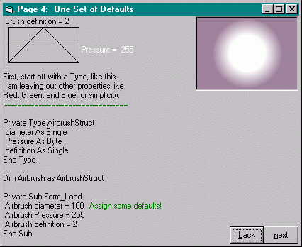



## how the precision airbrush works

### Description

a little tute for those of you who dig graphics programming
 
### More Info
 

             |
---                |---
**Submitted On**   |2003-03-06 21:48:48
**By**             |[dafhi](https://github.com/Planet-Source-Code/PSCIndex/blob/master/ByAuthor/dafhi.md)
**Level**          |Advanced
**User Rating**    |5.0 (40 globes from 8 users)
**Compatibility**  |VB 6\.0
**Category**       |[Graphics](https://github.com/Planet-Source-Code/PSCIndex/blob/master/ByCategory/graphics__1-46.md)
**World**          |[Visual Basic](https://github.com/Planet-Source-Code/PSCIndex/blob/master/ByWorld/visual-basic.md)
**Archive File**   |[how\_the\_pr155568372003\.zip](https://github.com/Planet-Source-Code/dafhi-how-the-precision-airbrush-works__1-43295/archive/master.zip)

